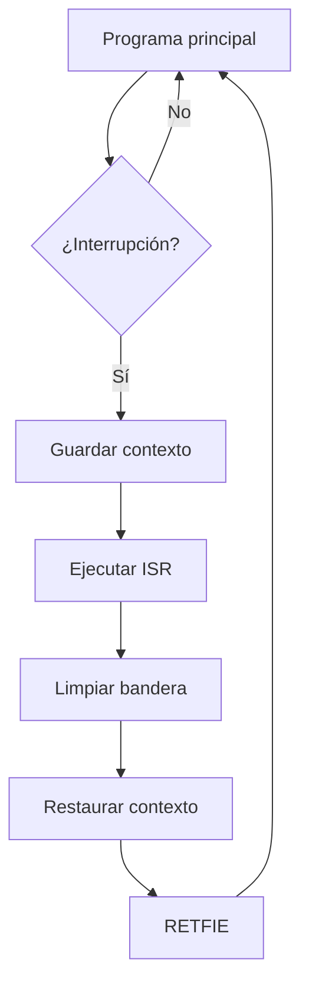

# Interrupciones

!!! note "En construcción"

    Este artículo está en desarrollo. El contenido se irá ampliando progresivamente.

---

## Conceptos clave

Las **interrupciones** permiten al microcontrolador suspender temporalmente la ejecución del programa principal para atender un evento externo o interno. Una vez atendido, se retoma la ejecución normal mediante la instrucción `RETFIE`.

---

## Temas a desarrollar

- [ ] Vector de interrupción y `RETFIE`
- [ ] Fuentes de interrupción: **INT**, **IOC** y temporizadores
- [ ] Priorización de interrupciones (alta / baja)
- [ ] Banderas y habilitación global (`GIE`, `PEIE`)
- [ ] Diseño de rutinas **ISR** eficientes
- [ ] Ejemplo: control de LED o contador con botón

---

## Diagrama de flujo de una interrupción

---

## Registros principales

| Registro | Descripción |
|:---------|:------------|
| `INTCON` | Control global de interrupciones (`GIE`, `PEIE`) |
| `PIRn` | Banderas (*flags*) de interrupción de periféricos |
| `PIEn` | Habilitación individual de interrupciones |
| `IPRn` | Prioridad de cada fuente de interrupción |
