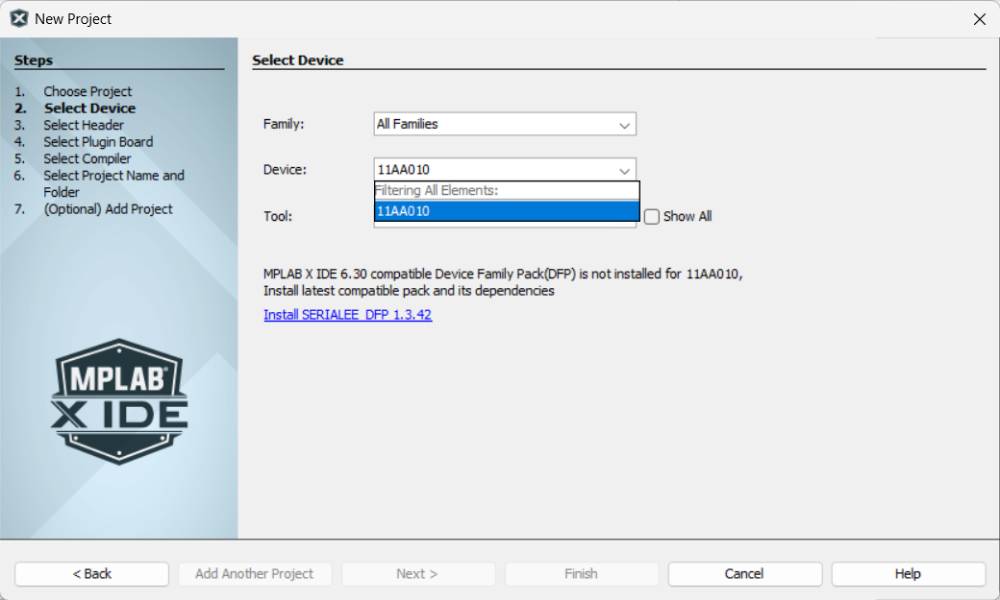

# Introducción y Entorno de Trabajo

## ¿Qué es un microcontrolador?
La definición clásica, que tal vez la habrás escuchado (y olvidado) antes, es que un microcontrolador (µC) es un computador **programable** pequeño que se presenta en un solo circuito integrado. Además, se compone por un procesador, memoria y periféricos.

Muy probablemente ya haz tratado con el microcontrolador [ATmega328P](https://www.microchip.com/en-us/product/atmega328p) (usado en el Arduino Uno) en cursos anteriores, pero en este curso nos enfocaremos en el [PIC18F57Q43](https://www.microchip.com/en-us/product/pic18f57q43) (en adelante, 'Q43') y el [PIC18F47Q10](https://www.microchip.com/en-us/product/pic18f47q10) (en adelante, 'Q10'). Se usa el Q10 porque puede ser simulado en Proteus, pero el Q43 posee más periféricos y características avanzadas.

De la definición, se resalta que un µC:

- Se programa. O sea, que al energizarlo, no hará nada si no le haz cargado un programa previamente. Por ejemplo, el Q10 y Q53 se programan mediante el [PicKit 5](https://www.microchip.com/en-us/development-tool/PG164150) o el Curiosity Nano respectivo de cada uno.
- Es pequeño. Por ende, es barato (~0,5-3 USD los de 8-bits) y con recursos de procesamiento y almacenamiento limitados.
- Tiene un procesador. Comercialmente se encuentran microcontroladores de **8**, 16 y **32** bits. Por ejemplo, el Q10, Q53 y ATmega328P son de 8 bits, mientras que el ESP32 es de 32 bits. La cantida de bits se refiere a la cantidad de bits que el procesador puede manejar en una sola operación. O sea, es el ancho de los registros, buses de datos y direcciones.
- Tiene memoria. Los µC cuentan con diferentes tipos de memoria: no volátil (ej: Flash y EEPROM) para el programa y datos persistentes, y volátil (ej: SRAM) para datos temporales.
- Tiene periféricos. Son módulos integrados que permiten al µC interactuar con el mundo exterior o realizar funciones específicas sin necesidad de hardware adicional. Todos los µC tienen puertos de E/S. En adicion, el Q43 y Q10 tienen modulos temporizadores, ADC, UART, etc.

En fin, aclaro que en la UPC se abandonó el Q53 por el Q10 y que, a pesar de que el Q10 se puede simular, debes comprar el Curiosity Nano del [Q10](https://www.microchip.com/en-us/development-tool/dm182029) si planeas aprobar el curso (o el del [Q43](https://www.microchip.com/en-us/development-tool/dm164150), si te lo permiten). Adicionalmente, te recomiendo que descargues el datasheet del Curiosity Nano que compres y el de su microcontrolador para que lo tengas a la mano.

## Familia PIC18F — Visión general

{width="280" align=left}

La familia PIC18F de Microchip Technology es la serie tope de gamma de sus microcontroladores PIC de 8 bits. Estos dispositivos son conocidos por su arquitectura RISC, eficiencia energética y amplia gama de periféricos integrados. Como su nombre advierte, el Q10 y Q43 pertenecen a esta serie.

 

## Entorno de desarrollo
Para desarrollar software para los PIC, se suele usar MPLAB X IDE, el entorno de desarrollo integrado oficial de Microchip. Aun así, también se puede usar VSCode con la extensión MPLAB. Para ello, recomiendo instalarlo en un perfil de VSCode que no sea el default por el peso de la extensión. Además, es mejor si solo usas un IDE para evitar el secuestro del programador de tu Curiosity Nano.

### Instalar MPLAB X IDE
Te recomiendo que uses Windows. Eres ingenier/a, no productor/ra musical. De este modo, solo debes descargar el [instalador](https://www.microchip.com/en-us/tools-resources/develop/mplab-x-ide), dar siguiente, siguiente, siguiente y listo.

!!! warning "No intales todos los compiladores"
    Solo necesitas el XC8, que incluye el PIC-AS (assembler). No es necesario instalar el XC16 ni el XC32.

### Crear proyectos en MPLAB X

Para crear un nuevo proyecto, haz clic en **"File" → "New Project"** o en la esquina superior izquierda, en el ícono de "New Project". Te saldrá la siguiente ventana:

<figure markdown="span" style="text-align: center;">
  {width="80%"}
  <figcaption>Paso 1: Selección del tipo de proyecto</figcaption>
</figure>

Aquí, siempre damos "Siguiente". Luego, te pedirán elegir tu dispositivo (PIC18F57Q43 o PIC18F47Q10) y la herramienta. Si no quieres escribir el nombre completo, puedes conectar de antemano tu Curiosity Nano y se seleccionarán ambas automáticamente. De no contar con el hardware, puedes escribir el nombre del PIC en el buscador y seleccionar "Simulator" como herramienta. Después, dale click en "Siguiente".

<figure markdown="span" style="text-align: center;">
  {width="80%"}
  <figcaption>Paso 2: Selección del dispositivo y herramienta de programación</figcaption>
</figure>

Lo que sigue es elegir el compilador. En la primera parte del curso usaremos el lenguaje ensamblador (pic-as), pero luego pasaremos a C (xc8). Elige el que corresponda y dale "Siguiente".

<figure markdown="span" style="text-align: center;">
  {width="80%"}
  <figcaption>Paso 3: Selección del compilador</figcaption>
</figure>

Finalmente, elige un nombre para tu proyecto y la ubicación donde se guardará. Puede que parezca el paso más trivial, pero si eliges una ubicación con espacios o caracteres especiales, podrías tener problemas más adelante. De preferencia, usa la ruta por defecto con un nombre de proyecto con nomenclatura CamelCase o snake_case. Luego, deselecciona "Abrir Open MCC al finalizar", haz clic en "Finalizar" y listo, ya tienes tu proyecto creado.

<figure markdown="span" style="text-align: center;">
  {width="80%"}
  <figcaption>Paso 4: Nombre y ubicación del proyecto</figcaption>
</figure>

Por si vas a crear el proyecto en MPLAB X IDE, pero editar los archivos en VSCode, te recomiendo que cambies el encoding UTF-8, ya que por defecto está seleccionado el ISO-8859-1, lo que puede generar problemas con las tildes y eñes.