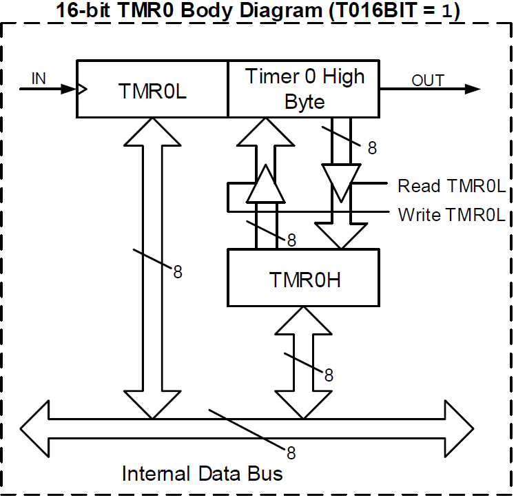

# Temporizadores

El PIC18F57Q43 cuenta con tres módulos de temporización principales:

| Módulo | Resolución | Uso típico |
|:------:|:----------:|:----------:|
| TMR0 | 8 o 16 bits | General |
| TMR1 | 16 bits | Tiempo preciso |
| TMR2 | 8 bits | PWM, ADC |

---

## Timer 0 (TMR0)

### Descripción general

- Temporizador/contador de **8 o 16 bits** que incrementa su valor en cada flanco positivo de la fuente de reloj.
- Cuando llega al valor máximo ocurre un **overflow** (16 bits) o un **match** (8 bits). En ambos casos, se reinicia la cuenta.
- Si un evento de overflow/match ocurre la cantidad de veces configurada en el postscaler, se levanta la bandera `T0IF` (`PIR3<7>`) y `T0_out` (`CON`) se alterna.
- La cuenta actual está en los registros `TMR0L` y `TMR0H` (en 8 bits solo `TMR0L`).

!!! info "Configuración básica"

    1. Configurar `T0CON1` (fuente de reloj) y `T0CON0` (modo y prescaler).
    2. **8 bits:** Escribir en `TMR0H` el *valor final + 1*.
    3. **16 bits:** La cuenta máxima es 65 535. Se puede inicializar la cuenta escribiendo en `TMR0H:TMR0L` con `EN = 0`.
    4. **PPS:** Escribir en `RxyPPS` el valor `0x39`. Solo para RC y RF. Divide ÷2 la frecuencia de `T0_out`.
    5. **T0IF:** Encender `PIE3<7>`. Bajar `PIR3<7>` al atender la interrupción.

$$
\text{duración} = \frac{4}{F_{osc}} \times \text{prescaler} \times \text{cuenta máxima} \times \text{postscaler}
$$

---

### Modo 8 bits

Como se aprecia en su diagrama de bloques, el `TMR0L` es comparado con `TMR0H` en cada cuenta. Si son iguales, se genera un **match** y el `TMR0L` se reinicia a 0. Por lo tanto, en modo de 8 bits, **se puede contar hasta 254** porque al llegar a 255 se genera el match y se reinicia a 0.

$$
\text{cuenta máxima} \leq 254
$$

Para configurar la $\text{cuenta máxima}$, se debe escribir en `TMR0H` el $\text{valor final} + 1$ deseado.

!!! example "Ejemplo"

    Si se escribe `100` en `TMR0H`, el `TMR0L` contará desde 0 hasta 99 (100 cuentas) y luego ocurrirá el match.

<figure markdown="span">
  { width="50%" }
  <figcaption>Diagrama de bloque del TMR0 en modo 8 bits</figcaption>
</figure>

---

### Modo 16 bits

La cuenta máxima en modo de 16 bits es **65 535**, ya que `TMR0H:TMR0L` incrementa hasta llegar a su valor máximo (`FFFF`) y luego ocurre un **overflow**, reiniciándose ambos registros a 0.

!!! warning "Orden de lectura / escritura"

    - **Leer:** primero `TMR0L`, luego `TMR0H`.
    - **Escribir:** primero `TMR0H`, luego `TMR0L`.

<figure markdown="span">
  { width="50%" }
  <figcaption>Diagrama de bloque del TMR0 en modo 16 bits</figcaption>
</figure>

---

## Registros de configuración

### T0CON0 — `BSR = 3`

| Bit | 7 | 6 | 5 | 4 | 3 : 0 |
|:---:|:---:|:---:|:---:|:---:|:---:|
| **Nombre** | `EN` | — | `OUT` | `MD16` | `OUTPS[3:0]` |
| **Acceso** | R/W | — | R | R/W | R/W |
| **Reset** | 0 | — | 0 | 0 | 0 |

`EN`
:   Habilita el temporizador. La cuenta se **pausa** si se deshabilita.

`OUT`
:   `T0_out` — salida del temporizador que se alterna al ocurrir la interrupción.

`MD16`
:   Selecciona modo 8 o 16 bits (`1` = 16 bits).

`OUTPS[3:0]`
:   Postescalador de salida. Cuenta $(\text{valor})$ eventos antes de levantar la bandera.

---

### T0CON1 — `BSR = 3`

| Bit | 7 – 5 | 4 | 3 | 2 – 0 |
|:---:|:---:|:---:|:---:|:---:|
| **Nombre** | `CS[2:0]` | `ASYNC` | `CKPS[3]` | `CKPS[2:0]` |
| **Acceso** | R/W | R/W | R/W | R/W |
| **Reset** | 0 | 0 | 0 | 0 |

`CS[2:0]`
:   Selecciona la fuente de reloj: CLC1\_OUT, SOSC, MFINTOSC 500 kHz, LFINTOSC, HFINTOSC, Fosc/4, $\overline{\text{T0CKIPPS}}$, T0CKIPPS.

`ASYNC`
:   `1` = fuente asíncrona · `0` = síncrona con el reloj del sistema.

`CKPS[3:0]`
:   Prescaler — divisor de frecuencia: $2^{(\text{valor})}$.

---

### TMR0H y TMR0L — `BSR = 3`

| Bit | 7 – 0 | 7 – 0 |
|:---:|:---:|:---:|
| **Nombre** | `TMR0H[7:0]` | `TMR0L[7:0]` |
| **Acceso** | R/W | R/W |
| **Reset** | `FFh` | `00h` |

---

### Registros de interrupción

| Registro | Bit | Nombre | Descripción |
|:---------|:---:|:------:|:------------|
| `PIR3` (BSR = 4) | `<7>` | `TMR0IF` | Flag de interrupción |
| `PIE3` (BSR = 4) | `<7>` | `TMR0IE` | Habilita la interrupción |
| `IPR3` (BSR = 3) | `<7>` | `TMR0IP` | `1` = alta prioridad |
