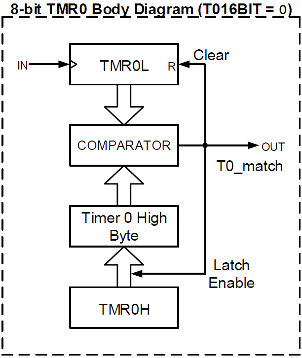

### 🟩 Unidad 4 – Temporizadores
- **TMR0**, **TMR1**, **TMR2**: diferencias y configuración básica  
- Generación de retardos con **TMR0**  
- Base de tiempo y eventos periódicos  
- Introducción a interrupciones por **TMR0**  

 ---

TMR0 | TMR1 | TMR2
-----|------|-----
8 o 16 bits | 16 bits | 8 bits
General | Tiempo preciso | PWM, ADC

### Timer 0 (TMR0)

- Es un temporizador/contador de 8 o 16 bits que incrementa su valor en cada flanco positivo de la fuente de reloj.
- La cuenta actual de 16 bits se almacena en los registros TMR0L (reset: 00) y TMR0H (reset: FF). Para 8 bits, TMR0L es suficiente.
- Cuando llega al valor máximo ocurre un overflow en el caso del contador de 16 bits o un match en el caso del contador de 8 bits. En ambos casos, después se reinicia a 0.
- Si un evento de overflow/match la can tidad de veces configurada en el postscaler, se genera una interrupción con T0IF (interrupt flag).
- Es versátil, pero su medición del tiempo no es tan precisa como la de TMR1.

$$ duración = \dfrac 4 {F_{osc}}\times prescaler \times cuenta\ máxima \times postscaler$$

## 8-Bit mode
Como se aprecia en su diagrama de bloques, el TMR0L es comparado son TMR0H en cada cuenta. Si son iguales, se genera un match y el TMR0L se reinicia a 0. Por lo tanto, en modo de 8 bits, **se puede contar hasta 254** porque al llegar a 255 se genera el match y se reinicia a 0.

